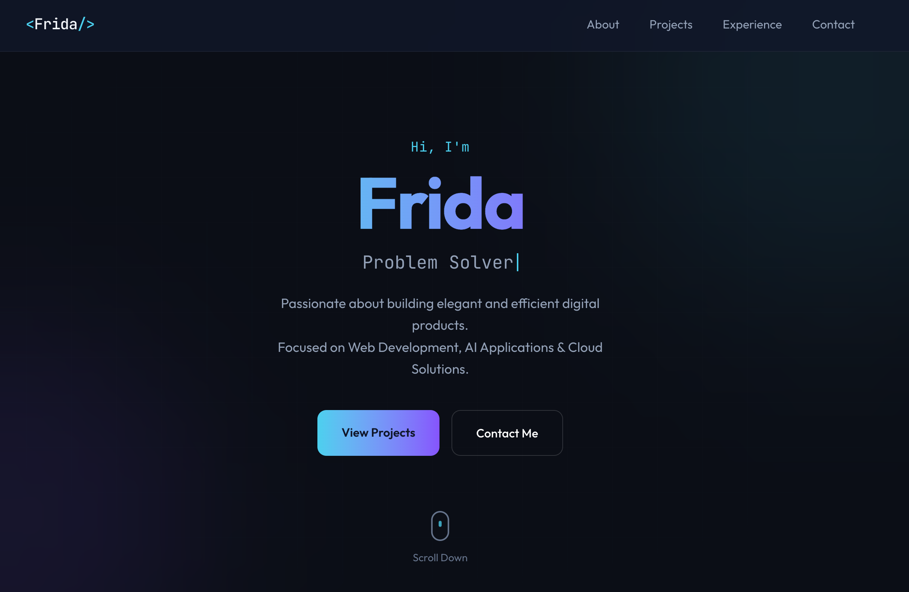

# Personal Portfolio

A modern, responsive personal portfolio website built with Next.js, TypeScript, and Tailwind CSS.

🔗 **Live Demo**: [frida-li.com](https://www.frida-li.com/)



## Features

- ⚡ **Next.js 16** with App Router and Turbopack
- 🎨 **Tailwind CSS** for styling with custom dark theme
- 📱 **Fully Responsive** - mobile-first design
- 🖼️ **Image Lightbox** - click to view project screenshots
- ✨ **Smooth Animations** - scroll-based reveal effects
- 🚀 **Optimized Performance** - 95+ Lighthouse score

## Tech Stack

- **Framework**: Next.js 16 (App Router)
- **Language**: TypeScript
- **Styling**: Tailwind CSS
- **Icons**: React Icons
- **Deployment**: Vercel

## Getting Started

```bash
# Install dependencies
npm install

# Run development server
npm run dev

# Build for production
npm run build
```

Open [http://localhost:3000](http://localhost:3000) to view the site.


## Deployment

Deploy to Vercel with one click:

[](https://vercel.com/new/clone?repository-url=https://github.com/Frida7771/portfolio)

## License

MIT © Frida Li
